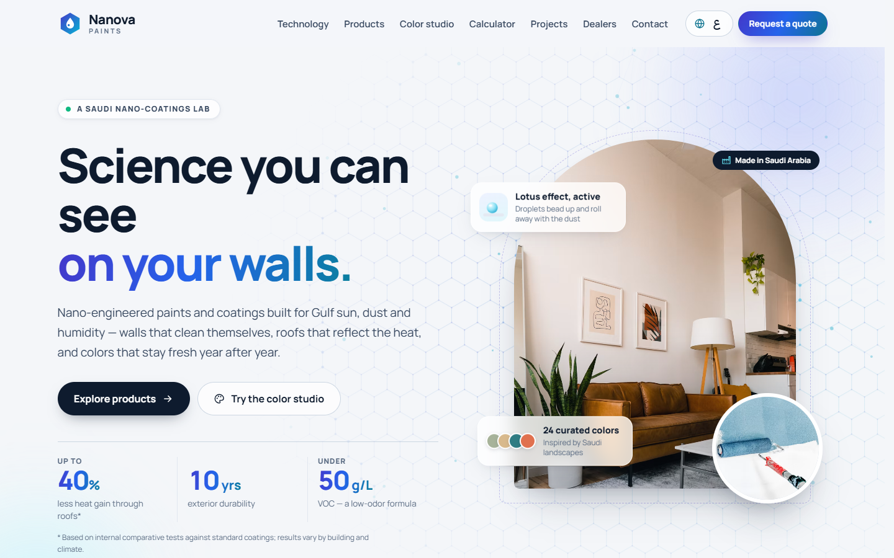
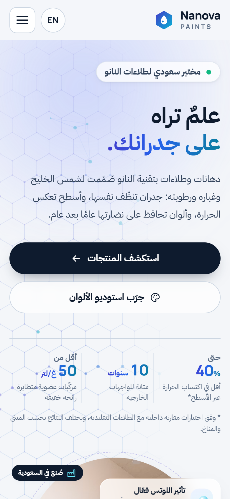

# 🎨 Nanova Paints

**A bilingual website for a nano-technology paint manufacturer**

**[▶ Live demo](https://sam-designs-studio.github.io/nanova-paints/)**

> Concept design project — designed and developed by **Sam**. Nanova Paints is a fictional brand; products, figures and dealers are sample content.

## Features

- **Arabic & English** — one-click language switch with full right-to-left / left-to-right layout, remembered between visits
- **Animated hero** — a lightweight nano-lattice animation that pauses off-screen
- **How it works** — illustrated lotus-effect diagram and six product benefits
- **Before / after slider** — drag, swipe or use the arrow keys
- **Product catalogue** — filter by use, with detailed spec pop-ups
- **Color studio** — pick from 24 colors to repaint an illustrated room live, and save favourites
- **Paint calculator** — room size, doors, windows and coats → litres needed and the best can combination
- **Projects gallery** with lightbox, **dealer finder** by city, FAQ and a validated quote-request form
- **Responsive & accessible** — phones to wide screens, keyboard friendly, respects reduced-motion settings

## Built with

HTML5 · CSS3 · vanilla JavaScript — no frameworks, no build step.

---

## ‏Nanova Paints — موقع ثنائي اللغة لشركة دهانات

موقع لشركة تصنّع دهانات وطلاءات بتقنية النانو.

**[▶ معاينة الموقع مباشرة](https://sam-designs-studio.github.io/nanova-paints/)**

> مشروع تصميمي تجريبي — تصميم وتطوير **Sam**. العلامة التجارية والمنتجات والأرقام والموزعون محتوى تجريبي.

### المزايا

- **العربية والإنجليزية** — تبديل فوري بين اللغتين مع تغيير اتجاه الصفحة بالكامل وحفظ الاختيار
- **واجهة متحركة** — رسم متحرك خفيف لجزيئات النانو يتوقف عند الخروج من الشاشة
- **كيف تعمل التقنية** — رسم توضيحي لتأثير ورقة اللوتس وست فوائد رئيسية
- **شريط مقارنة قبل وبعد** — بالسحب أو اللمس أو أسهم لوحة المفاتيح
- **كتالوج المنتجات** — فلترة حسب الاستخدام مع نوافذ مواصفات تفصيلية
- **استوديو الألوان** — اختر من بين 24 لونًا لإعادة طلاء غرفة توضيحية مباشرة واحفظ ألوانك المفضلة
- **حاسبة الدهان** — مقاسات الغرفة والأبواب والنوافذ وعدد الطبقات لحساب اللترات وأفضل تركيبة عبوات
- **معرض المشاريع** مع عارض صور، و**البحث عن الموزعين** حسب المدينة، وأسئلة شائعة، ونموذج طلب عرض سعر
- **تصميم متجاوب وسهل الاستخدام** — من الجوال حتى الشاشات العريضة، ويدعم التنقل بلوحة المفاتيح

### التقنيات المستخدمة

‏HTML5 و CSS3 و JavaScript دون أي مكتبات جاهزة.

